<div align="center">

# Habit maker

**Build daily habits, earn the rewards you set yourself.**

A fast, offline Android habit tracker: tick off your habits every day, watch your weekly,
monthly and final rewards fill up, and claim them once they are earned.

[](https://github.com/ngth1010v/Habit-maker/releases/latest)


[](LICENSE)

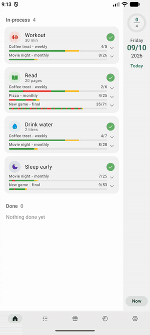&nbsp;&nbsp;
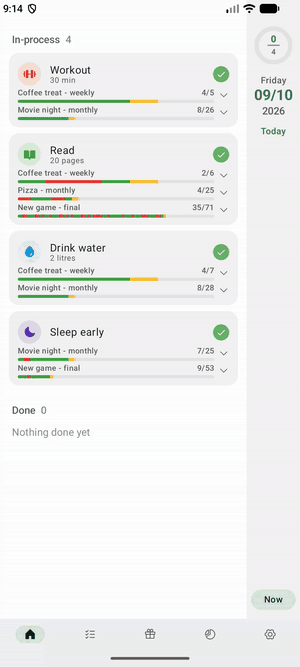&nbsp;&nbsp;
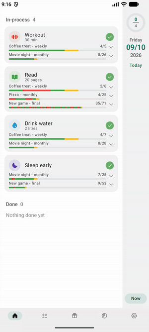

</div>

---

## Contents

- [Features](#features)
- [Screenshots](#screenshots)
- [How to install](#how-to-install)
- [How to use](#how-to-use)
- [Build from source](#build-from-source)
- [License](#license)

## Features

- **Daily habits** with an icon (1,000+ [Phosphor](https://phosphoricons.com/) icons), a color
  from a 15 x 5 palette, a note, a start date and an optional end date.
- **Rewards you define yourself.** Link a habit to a weekly, monthly and/or final reward.
- **Miss tolerance.** For example, a weekly reward with a tolerance of 2 is still earned with
  5 of 7 days done.
- **Day-by-day progress bars.** Each day of the period is shown in color: done (green), today (yellow),
  missed (red), still to come (gray).
- **Reward charts.** Tap a bar to see your done days add up. A red area shows how far behind you can
  fall and still earn the reward. A green area shows where the reward is earned.
- **Day navigation.** Swipe the date panel up or down to see any day, past or future.
- **Claim earned rewards** and see how many times you have earned each one.
- **Backup.** Export everything to a single `.sql` file and import it again on any device.
- **Fast and private.** Opens fast, works fully offline, needs no account and has no ads or tracking.
- English and Vietnamese.

## Screenshots

| Home | Reward charts | Habits | Rewards |
|:---:|:---:|:---:|:---:|
| 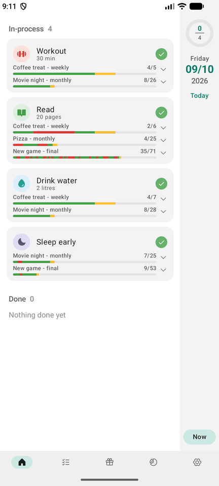 | 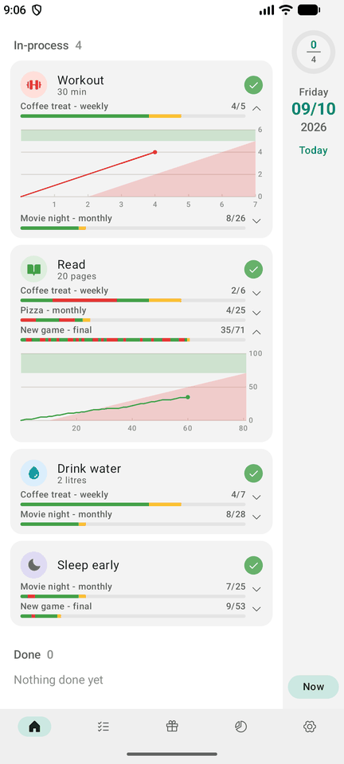 | 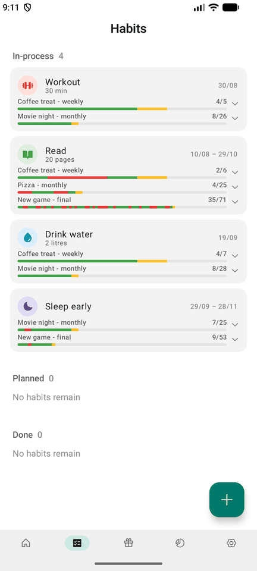 | 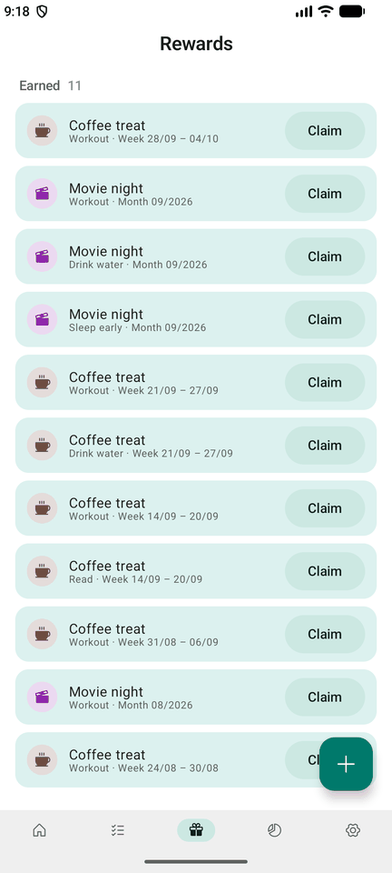 |

| Edit a habit | Habit rewards | Icon picker | Settings |
|:---:|:---:|:---:|:---:|
| 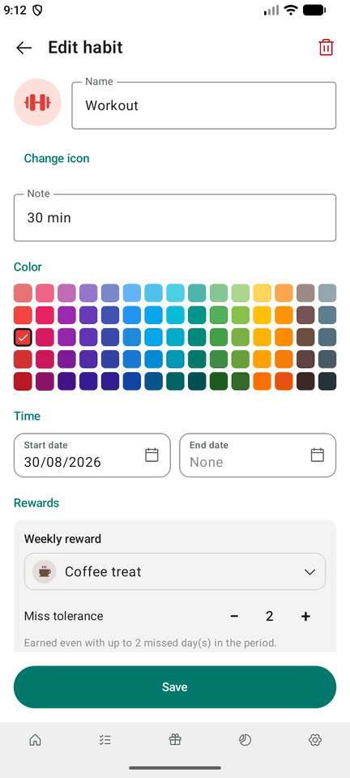 | 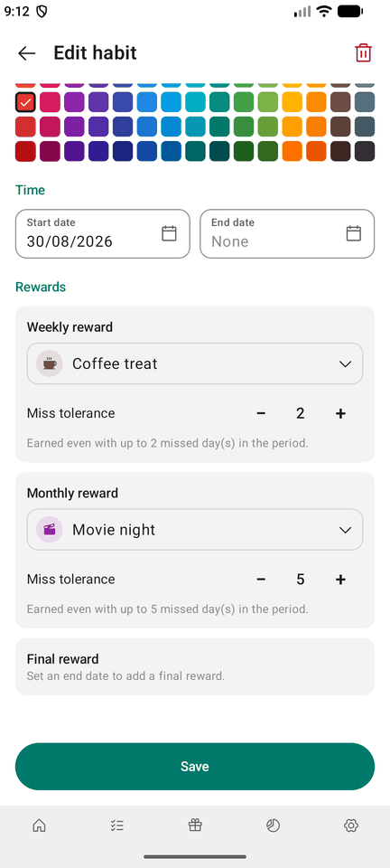 | 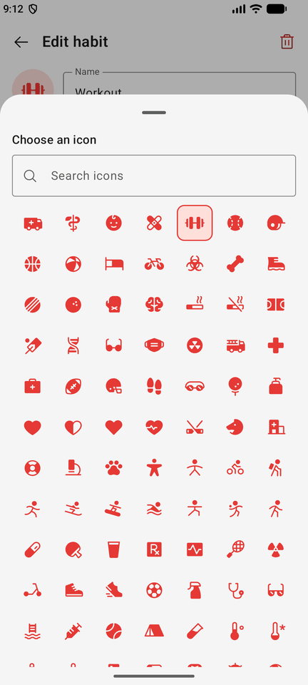 | 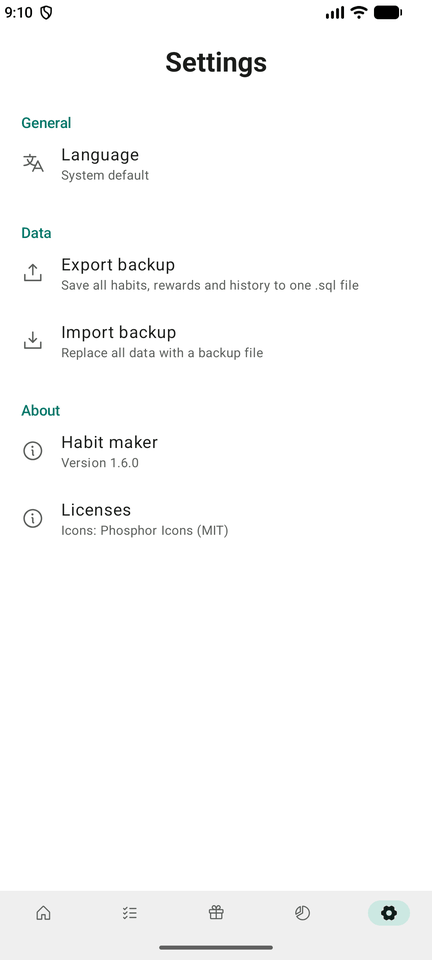 |

## How to install

Habit maker runs on **Android 11 (API 30) or newer**.

1. Open the [latest release](https://github.com/ngth1010v/Habit-maker/releases/latest) on your
   phone and download `Habit-maker-<version>.apk`.
2. Open the downloaded file. If Android asks, allow your browser or file manager to
   **install unknown apps** (Settings > Apps > Special app access > Install unknown apps).
3. Tap **Install**, then **Open**.

To update, install the newer APK over the old one. Your data is kept.

> [!TIP]
> Before switching phones or reinstalling, export a backup from **Settings > Data > Export backup**.
> Then import it on the new install.

## How to use

### 1. Create your rewards

Open the **Rewards** tab (gift icon) and tap **+**. Give the reward a name and an icon, for example
*Coffee treat* or *Movie night*. You can link the same reward to several habits.

### 2. Create a habit

Open the **Habits** tab and tap **+**. Enter a name and pick an icon and a color. Set the start date
(today by default) and, if you like, an end date. Then choose the rewards:

| Reward | Earned when | Miss tolerance |
|---|---|---|
| **Weekly** | the habit is done on enough days of a calendar week (Mon-Sun) | days you may miss in the week |
| **Monthly** | the habit is done on enough days of a calendar month | days you may miss in the month |
| **Final** | the habit is done on enough days between the start and end date (needs an end date) | days you may miss overall |

A week or month that is cut by the start or end date only counts its days inside the habit's dates.

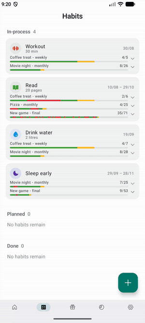

### 3. Tick off your habits every day

The **Home** tab lists today's habits under *In-process*. Tap the green tick when you have done a habit
and it moves to *Done*. The ring at the top right counts how many are done. Tap the red x to undo.

Only **today and yesterday** can be changed, so a day you forgot can still be ticked the next morning.

### 4. Follow your rewards

Each habit shows one bar per reward. The label shows *done / needed* days for the current
period, and each section of the bar is one day:

- 🟩 done
- 🟨 today, not done yet
- 🟥 missed
- ⬜ still to come

Tap a bar to open its chart. The line is your done days adding up. Stay out of the **red** area, or
the reward can no longer be earned. When the line reaches the **green** area, the reward is earned.

### 5. Look back or ahead

On Home, swipe the **date panel on the right** up for the next day and down for the previous one.
Tap **Now** to jump back to today. Past days show what you missed, and future days show what is
coming up.


Swipe sideways anywhere to move between tabs.

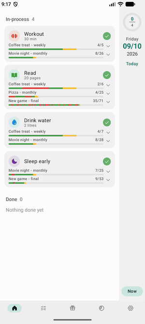

### 6. Claim your rewards

As soon as a reward is earned, even mid-week, it appears under **Earned** in the Rewards tab.
Give yourself the reward, then tap **Claim**. The trophy badge on each reward counts how many times it was
earned.

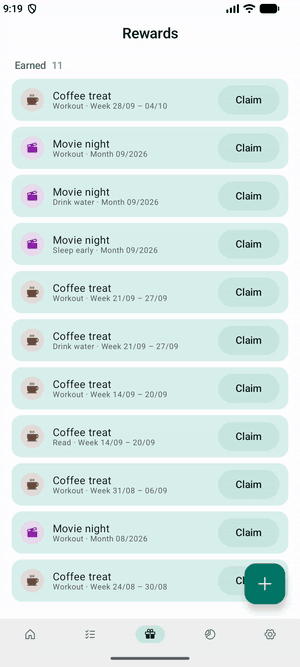

### 7. Back up your data

Go to **Settings > Data**:

- **Export backup** saves all habits, rewards and history to one `.sql` file.
- **Import backup** replaces everything on this device with a backup file.

You can also change the language in **Settings > General**.

## Build from source

Requirements: Android Studio (its bundled JDK) and the Android SDK with API 37.

```bash
git clone https://github.com/ngth1010v/Habit-maker.git
cd Habit-maker
./gradlew assembleDebug          # app/build/outputs/apk/debug/app-debug.apk
./gradlew testDebugUnitTest      # unit tests for the schedule and reward rules
./gradlew installDebug           # install on a connected device or emulator
```

The app is built with Kotlin, Jetpack Compose (Material 3), Room and a baseline profile for fast
start-up. See [CLAUDE.md](CLAUDE.md) for an overview of the architecture.

## License

[MIT](LICENSE). Icons are from [Phosphor Icons](https://phosphoricons.com/) (MIT).
